# 🧠📈 Multi-Agent Stock Analysis System with AutoGen & Groq LLaMA-3

This project demonstrates a **multi-agent system** built using [AutoGen](https://github.com/microsoft/autogen) and Groq's LLaMA 3 model, designed to **automate the analysis of Apple (AAPL) stock's daily closing prices** over the past month. The system utilizes a collaborative architecture involving multiple AI agents—each assigned a specific role in the data analysis pipeline.

> 🚀 Run it in Google Colab and get an AI-generated stock report in markdown format!

---

## 📌 Features

- ✅ Fetches and analyzes stock data (past 1 month of AAPL closing prices)
- ✅ Implements multi-role agents: Planner, Engineer, Executor, Writer
- ✅ Uses LLaMA 3 via Groq API for language tasks
- ✅ Fully automated conversation and coordination using `autogen.GroupChat`
- ✅ Generates a human-readable Markdown report
- ✅ Accepts iterative feedback from the user

---

## 🛠️ Architecture Overview

```mermaid
graph TD
    Admin("👤 Admin (User Proxy)") -->|Gives Task| Planner
    Planner("🧠 Planner") -->|Plans Steps| Engineer
    Engineer("🧑‍💻 Engineer") -->|Writes Code| Executor
    Executor("⚙️ Executor") -->|Runs Code & Fetches Results| Writer
    Writer("✍️ Writer") -->|Writes Report| Admin
    Admin -->|Feedback| Writer
```



# 🧩 Agents & Roles
**Agent**	            
- `Admin`	      Provides the task and feedback (human-in-the-loop)
- `Planner`	    Breaks down the task into code-executable data analysis steps
- `Engineer`	  Writes Python code for stock data fetching and analysis
- `Executor`	  Executes Python code and returns results
- `Writer`	    Converts results into a markdown report and refines it based on feedback

# 🚀 How to Run
##✅ Prerequisites
- Google Colab environment

- Groq API key stored in Colab's userdata:

```python
from google.colab import userdata
userdata.set("GROQ_API_KEY", "<your_api_key>")
```

# ▶️ Steps
1. Clone or copy the Colab notebook.

2. Run the setup cells to define agents and configurations.

3. Execute the `user_proxy.initiate_chat()` cell to start the agent conversation.

4. Review the generated markdown report and provide feedback if needed.

# 📦 LLM Configuration
```python
llm_config = {
    "model": "llama-3.3-70b-versatile",
    "api_key": userdata.get("GROQ_API_KEY"),
    "api_type": "groq"
}
```

# 📊 Sample Task
```python
task = "Analyze the daily closing prices of Apple (AAPL) stock for the past 1 month and create a brief report."
```

# 🤝 License
[MIT License](LICENSE.txt)

🙋‍♂️ Author
[Mohamed Shaad](https://www.linkedin.com/in/mshaadk/)
